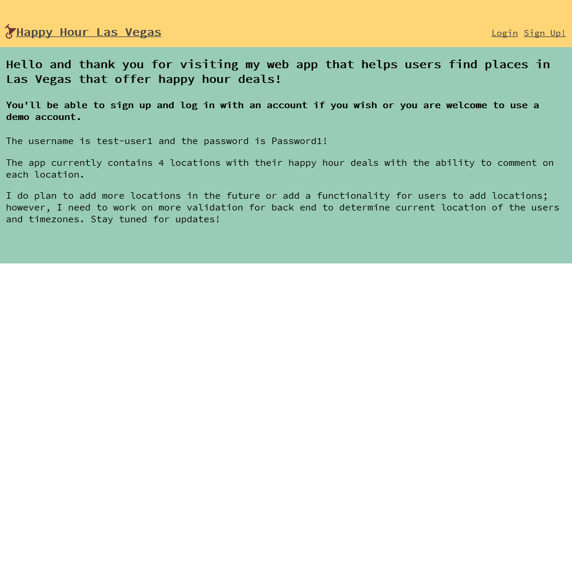
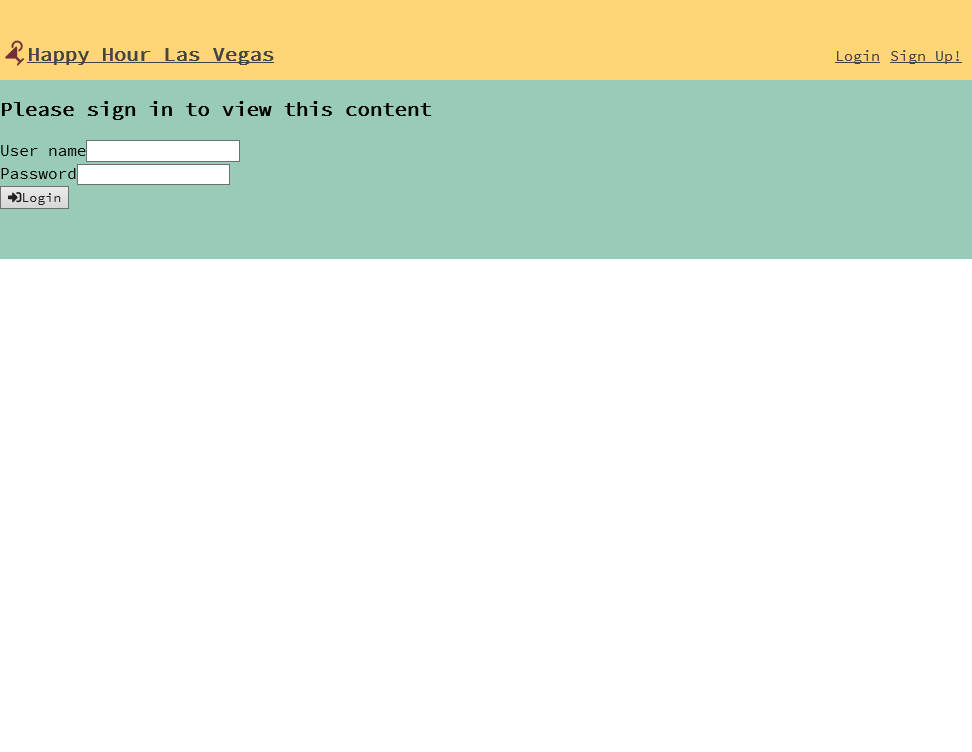
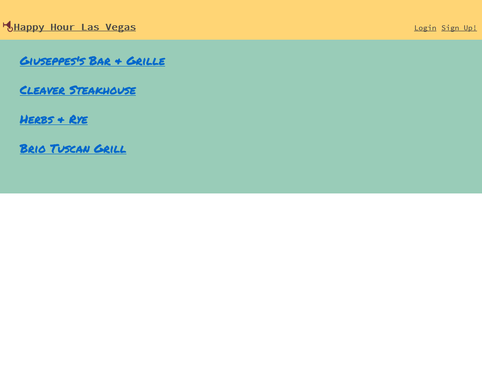
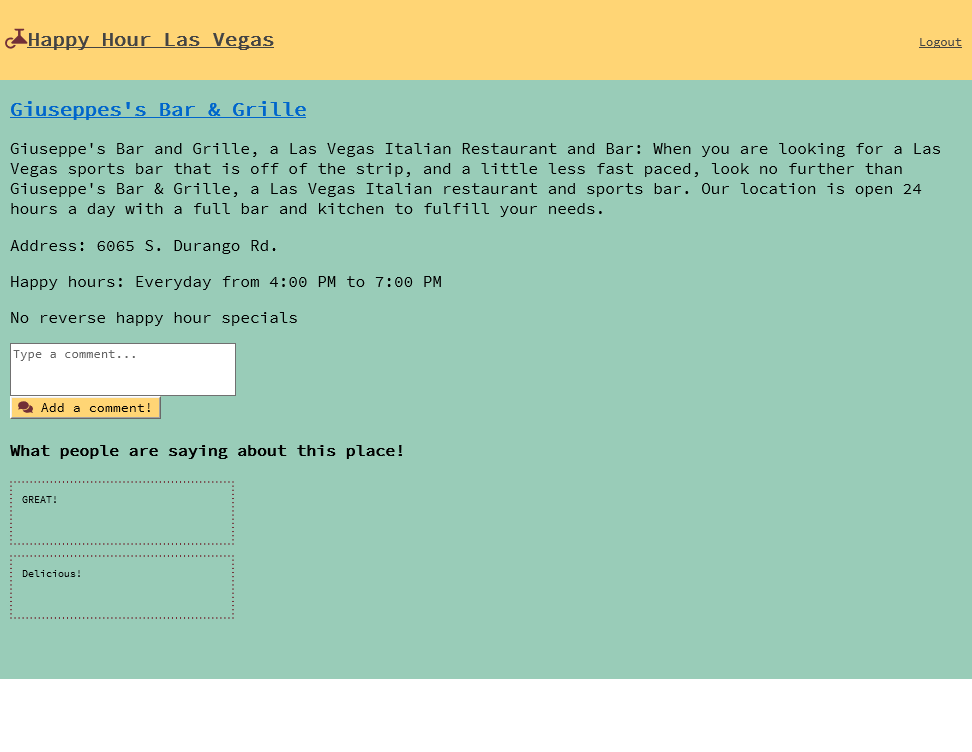

## [Happy Hour Las Vegas](https://happy-hour-las-vegas-app.enguyen89141.now.sh/)

* This app connects to my [Happy Hour API](https://github.com/enguyen89141/happy-hour-las-vegas-api) which includes more documentation
### Summary
* This app gives users the ability to see different Las Vegas restaurant/bar locations that offer happy hour specials. 
* Users can simply view the list of names or if they wish can sign up/login and view the details of each location
* When looking at the code itself you'll see that the components are utilized in the routes which are similar to views in an MVC framework.
* The contexts are used in order to pass along state information that can is utilized across different routes in the application.
* The services contain methosd for authentication and communication with my backend API. 

## Technology Used
* This app utilizes HTML/CSS, ReactJS, Node.js, Express, PostgreSQL, as well as JWT authentication. 

### Screenshots
1. Welcome page  
 
2. Login page  
 
3. Deals page  
 
4. Details page  
 
